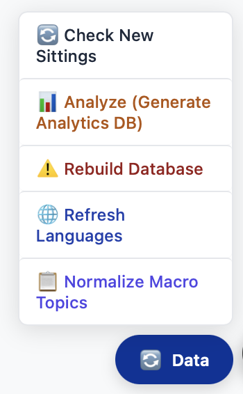

# EUROWATCH v1.1 — European Parliament Speech Analysis Platform

A web application and analysis platform for European Parliament speeches: data collection, AI-powered topic classification, language detection, macro-topic normalization, and analytics for political research.

## What's new in v1.1

- **Clean, scalable codebase** — All application code under `src/`: `core/` (DB, fetch, parsing, analytics, language detection, topic agents, group normalizer), `server/` (Express glue, init-db, analytics cache, MEP sync), `pipeline/` (refresh & bulk), `scripts/` (steps and one-off tools). Root stays minimal: `server.js`, `package.json`, `public/`, `data/`, `docs/`.
- **Data menu (floating button)** — All main data operations are available from the **Data** floating button: Check New Sittings, Build MEP Dataset, Refresh Languages, Normalize Macro Topics, Normalize Parties, Analyze (Generate Analytics DB). **Rebuild Database** is at the bottom (no step number), with a red background — use only when you need a full rebuild from scratch.
- **Build MEP Dataset** — Clears MEP data and rebuilds from the EP API (term 5 to current), links speeches by name, creates historic MEPs for remaining speakers, runs the political group normalizer on speeches, then **syncs MEP affiliations** from speeches to `meps.politicalGroup` (so the MEP list and pie chart match speech-derived groups and roles). Small affiliations (&lt; 10 MEPs) are collapsed to **Other**.
- **Normalize Parties** — Runs the political group normalizer on `individual_speeches` (sets `political_group_std`, kind, raw), then syncs affiliations to the MEP table (from standardized group, raw group, or **title** when no group is set). Titles like "Member of the Commission", "rapporteur", "Chair of the Delegation" are mapped to display labels; procedural titles (e.g. "in writing", "blue-card") are skipped. Again collapses small groups to **Other**. Use this to refresh affiliations without rebuilding MEPs.
- **MEP Role/Affiliation** — The dashboard shows one affiliation per MEP (pie chart, table, export). It is derived from speeches: normalized group, or raw `political_group`, or **title** (role). That value is synced to `meps.politicalGroup` when you run Normalize Parties or Build MEP Dataset. Affiliations with fewer than 10 members are displayed and stored as **Other**.
- **Normalize Macro Topics** — AI agent suggests rules to unify similar macro topics (e.g. "Foreign policy — Cuba" and "Foreign policy — Central America" → "Foreign policy — Americas"); optional test script for dry-run; apply from the Data menu.
- **Refresh Languages** — Re-run language detection on all speeches from the Data menu (CLD3 + franc, EU-constrained).
- **Analytics on demand** — Pre-computed analytics DB is generated via Data → **Analyze (Generate Analytics DB)** (step 6); Descriptive Analytics tab loads from it automatically when opened.
- **Pipeline** — `npm run pipeline` (or `npm run bulk -- --full`) for CLI-based refresh and bulk ingestion; see `src/pipeline/` and `docs/PROJECT_STRUCTURE.md`.

---

## Project overview

EUROWATCH collects, processes, and analyzes European Parliament speeches and combines scraping, NLP, and ML to support research on parliamentary proceedings and policy trends.

### Key features

- **Real-time data collection** — Pipeline to fetch and parse EU Parliament sittings and speeches
- **AI topic classification** — GPT-based speech categorization with macro/specific topics
- **Interactive dashboard** — MEPs, speeches, and Descriptive Analytics (topics, time series, by group/country, languages)
- **Language detection** — Automatic detection for 24 EU languages (CLD3 + franc)
- **Macro-topic normalization** — AI-suggested rules to unify duplicate or similar topic labels
- **Pre-computed analytics** — SQLite analytics DB for fast charts and filters
- **SQLite storage** — Main DB and analytics DB under `data/`

---

## Replication: running locally

Because the database and analytics files are not in the repo (size), you generate your own dataset. The recommended way is to use the **Data** floating button in the web UI and follow the order below.

### Prerequisites

- **Node.js** 18+
- **npm**
- **OpenAI API key** (for AI topic classification and Normalize Macro Topics; add to `.env`)

### Quick setup

```bash
git clone <repository-url>
cd EUROWATCH

npm install
echo "OPENAI_API_KEY=your-api-key-here" > .env
echo "LOCALRUN=1" >> .env   # required to show Data menu (local replication only)
npm start
```

Open **http://localhost:3000**. The **Data** button (floating, bottom-right) opens the menu for all data operations.

**LOCALRUN** — The floating Data menu and its actions (Check New Sittings, Build MEP Dataset, etc.) are only available when the `LOCALRUN` environment variable is set. Set it locally (e.g. `LOCALRUN=1` in `.env`) to use the menu. On the public website, do not set it so the menu is hidden and data actions are disabled.

### Data menu (floating button)

The main replication workflow uses the **Data** menu. Click the blue **Data** button to open it:



The menu lists **numbered steps (1–6)** and one unnumbered dangerous action at the bottom:

| Step | Action | When to use |
|------|--------|-------------|
| **1** | **Check New Sittings** | Incremental update: fetch and store only new sittings since last run. Fast; no normalizer or MEP rebuild. Use regularly after initial setup. |
| **2** | **Build MEP Dataset** | Clear all MEP data and rebuild: fetch MEPs from EP API (term 5+), link speeches by name, create historic MEPs for remaining speakers, run political group normalizer on speeches, sync affiliations to `meps.politicalGroup`, collapse small groups to **Other**. Use after you have sittings/speeches (e.g. after Rebuild Database or pipeline). |
| **3** | **Refresh Languages** | Re-detect language for every speech (overwrites existing). Run so all speeches have a language. |
| **4** | **Normalize Macro Topics** | AI agent suggests unification rules, then applies them so similar macro topics become one. Optional; requires `OPENAI_API_KEY`. |
| **5** | **Normalize Parties** | Run the political group normalizer on speeches (set `political_group_std` etc.), then sync MEP affiliations from speeches (group + title); collapse affiliations with &lt; 10 MEPs to **Other**. Does not rebuild MEPs. Use to refresh Role/Affiliation without a full MEP rebuild. |
| **6** | **Analyze (Generate Analytics DB)** | Build or rebuild the pre-computed analytics database (topics, time series, by group/country, languages). Required for the Descriptive Analytics tab. |
| — | **Rebuild Database** | **Dangerous.** Full rebuild from scratch (from 1999): all sittings and speeches. Shown at the bottom with a red background. Use only when you have no data or need to start over. Can take many hours. |

### Recommended order for a fresh install

When you have **no data yet**, use the Data menu in this order:

1. **Rebuild Database** (bottom of menu, red)  
   Fetches and stores all sittings and speeches from the EU Parliament (from 1999). This can take several hours. Use only when starting from scratch.

2. **Build MEP Dataset** (step 2)  
   Builds the MEP table from the EP API, links speeches, creates historic MEPs, normalizes political groups on speeches, and syncs Role/Affiliation to the MEP table (including from speech titles). Small groups become **Other**.

3. **Refresh Languages** (step 3)  
   Runs language detection on all speeches so the `language` column is filled.

4. **Normalize Macro Topics** (step 4)  
   Optional. Asks the AI for topic unification rules, then applies them. Requires `OPENAI_API_KEY`.

5. **Analyze (Generate Analytics DB)** (step 6)  
   Builds the analytics database used by the Descriptive Analytics tab. Re-run after big data changes.

For **regular updates** after that, use **Check New Sittings** (step 1). To refresh only MEP affiliations (and group normalization on speeches) without rebuilding MEPs, use **Normalize Parties** (step 5).

### Optional: test normalization (no DB writes)

To preview which macro topics would be merged without changing the database:

```bash
node src/scripts/test-normalize-macro-topics.js
```

Requires `OPENAI_API_KEY` and an existing DB with macro topics.

### Optional: CLI pipeline

For scripted or headless runs you can use the pipeline:

```bash
# Refresh: fetch and store new sittings from last fully processed date
npm run pipeline

# Full bulk: process a date range (see src/pipeline/index.js)
npm run bulk
```

Language detection and analytics are still best run from the Data menu (or see `server.js` and `src/core/` for API/scripts).

---

## Architecture

- **Frontend** — `public/`: main dashboard (`index.html`), speech view (`speech.html`), newest speeches (`newest.html`), shared `script.js` and styles.
- **Backend** — `server.js` (Express): REST API, serves static files, wires in `src/server/` (init-db, analytics cache, speeches fetch, MEPs, config).
- **Core** — `src/core/`: DB path, parliament fetch, parsing helpers, analytics DB, language detection, topic agent, normalize-topics agent and prompts.
- **Pipeline** — `src/pipeline/`: refresh (new sittings) and bulk (date range); uses `src/scripts/` steps (discover, fetch HTML, parse sitting, classify, store).
- **Data** — `data/`: main SQLite DB (`ep_data.db`), analytics DB (`analytics.db`), macro-topics list, macro-topic rules (from Normalize Macro Topics).

See **`docs/PROJECT_STRUCTURE.md`** for the full layout and roles of `src/core`, `src/server`, `src/pipeline`, and `src/scripts`.

---

## Installation & setup (summary)

- **Prerequisites:** Node.js 18+, npm, OpenAI API key (for AI features).
- **Install:** `npm install` and `echo "OPENAI_API_KEY=..." > .env`.
- **Run:** `npm start` → http://localhost:3000.
- **Replicate data:** Use the Data menu in order: Rebuild Database → Build MEP Dataset → Refresh Languages → (optional) Normalize Macro Topics → Analyze (Generate Analytics DB). For updates: Check New Sittings; to refresh affiliations only: Normalize Parties.

---

## Expected results after replication

- **Database** — `data/ep_data.db`: tables `sittings`, `individual_speeches`, `meps` (and related). Hundreds of thousands of speeches depending on date range. MEPs have `politicalGroup` synced from speeches (group or title); small groups stored as **Other**.
- **Languages** — 24 EU languages detected and stored per speech.
- **Topics** — Original agenda topics plus AI-classified macro/specific topics; optionally normalized via Normalize Macro Topics.
- **Role/Affiliation** — One per MEP (PPE, S&D, Committee Rapporteur, European Commission, Other, etc.), from speeches; &lt; 10 members shown as **Other**.
- **Analytics** — `data/analytics.db` and in-memory cache for the Descriptive Analytics tab (topics, time series, by group/country, languages).

---

## Important notes

- **Time** — Rebuild Database can take many hours; Check New Sittings is fast (new sittings only). Build MEP Dataset and Normalize Parties run the group normalizer and sync (minutes). Refresh Languages and Normalize Macro Topics scale with speech count; Analyze (Generate Analytics DB) usually finishes in under a few minutes.
- **Storage** — Main DB and analytics DB can grow to several GB for full history.
- **API costs** — OpenAI is used for topic classification (pipeline) and for Normalize Macro Topics; cost depends on usage.
- **WAL mode** — SQLite is run with WAL and optimized indexes for better read/write performance.

---

## API endpoints (overview)

- **Data:** `GET /api/meps`, `GET /api/speeches`, `GET /api/sittings`, `GET /api/cache-status`, `GET /api/analytics/cache-status`
- **Analytics:** `GET /api/analytics/overview`, `GET /api/analytics/time-series`, `GET /api/analytics/by-group`, `GET /api/analytics/by-language`, `GET /api/analytics/languages`
- **Actions (POST):** `POST /api/test-pipeline` (Check New Sittings), `POST /api/refresh-mep-dataset` (Build MEP Dataset), `POST /api/refresh-languages` (Refresh Languages), `POST /api/normalize-macro-topics` (Normalize Macro Topics), `POST /api/normalize-parties` (Normalize Parties), `POST /api/generate-analytics` (Analyze), `POST /api/rebuild-database` (Rebuild Database)
- **Search / speech:** `GET /api/search`, speech-by-id and related endpoints; see `server.js` for the full list.

---

## Technical notes

- **Modular layout** — `src/core` (shared logic), `src/server` (HTTP/init), `src/pipeline` (ingestion), `src/scripts` (steps and tools).
- **Analytics** — Pre-computed in a separate SQLite DB; loaded into memory on first use or via Data → Analyze; Descriptive Analytics tab warms the cache when opened.
- **Language detection** — `src/core/detect-language.js` (CLD3 + franc); optional script `src/scripts/detect-language.js`.
- **Normalize Macro Topics** — Prompt in `src/core/prompts/normalize-macro-topics.js`; agent in `src/core/normalize-topics-agent.js`; apply logic in `src/core/normalize-topics-apply.js`; rules saved under `data/macro-topic-rules.json`.
- **Political groups & MEP affiliation** — Group normalizer in `src/core/group-normalizer.js` (writes `political_group_std`, kind, raw on `individual_speeches`). Sync in `src/server/sync-mep-affiliations.js`: derives affiliation from `political_group_std`, raw `political_group`, or speech `title` (roles like rapporteur, Commission); skips procedural titles (e.g. "in writing", "blue-card"); maps to display labels; collapses affiliations with &lt; 10 MEPs to **Other** in the DB. Used after Normalize Parties and Build MEP Dataset. Display logic for API in `server.js` (GET /api/meps) and `src/server/affiliation-display.js`.

---

## Contributing

1. Fork the repo, create a feature branch, make changes, add tests if applicable, open a pull request.
2. Follow existing patterns; keep application code under `src/` as in `docs/PROJECT_STRUCTURE.md`.

---

## License

This project is licensed under the MIT License — see the LICENSE file for details.

---

## Acknowledgments

- European Parliament for open data access
- OpenAI for API and models
- Node.js and the npm ecosystem

---

**EUROWATCH** — Political research through data and AI
